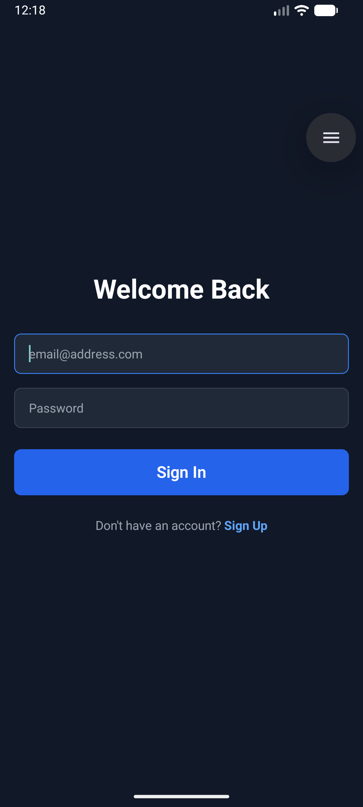
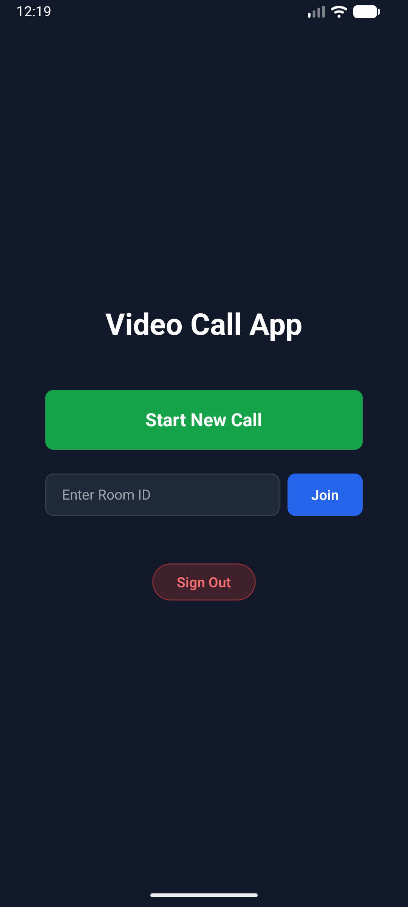
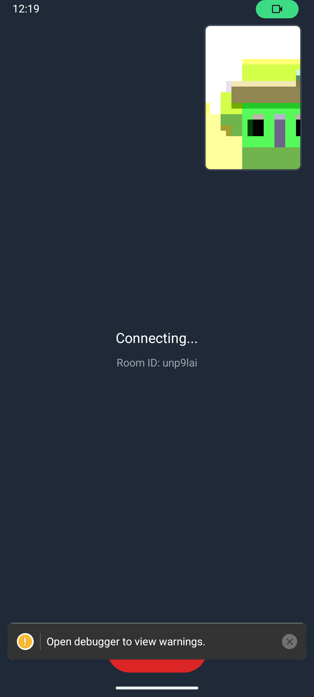
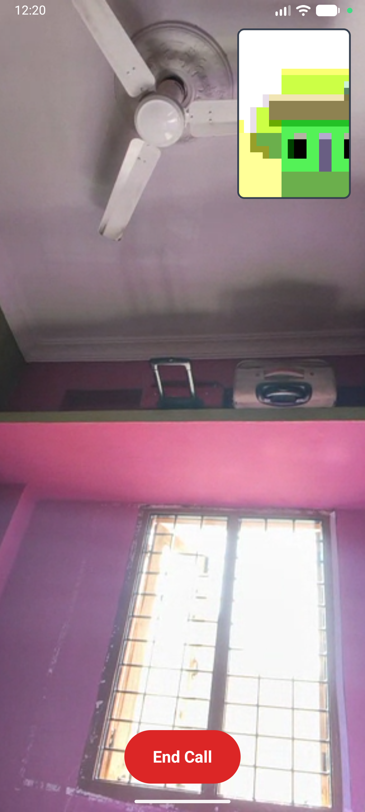

# 📹 Video Call App (React Native + WebRTC)

Welcome to the **Video Call App**! 🚀 This is a high-performance 1v1 video calling application built with **React Native CLI**, **WebRTC**, and **Supabase**.

---

## ✨ Features

- 📱 **Native Performance**: Built with React Native CLI (No Expo).
- 🎥 **Crystal Clear Video**: Powered by `react-native-webrtc`.
- 🔐 **Secure Authentication**: User management via **Supabase**.
- 🎨 **Beautiful UI**: Styled with **NativeWind** (Tailwind CSS for React Native).
- ⚡ **Real-time Signaling**: Node.js + Socket.io backend.
- 🔄 **State Persistence**: Users stay logged in (AsyncStorage).
- 🌍 **Multi-Environment**: Dev & Prod configurations.

---

## 🛠 Tech Stack

### Mobile (Client)
- **Framework**: React Native (CLI)
- **Video**: `react-native-webrtc`
- **Styling**: `nativewind`, `tailwindcss`
- **Navigation**: React Navigation (Stack)
- **Auth**: `@supabase/supabase-js`

### Backend (Server)
- **Runtime**: Node.js
- **Framework**: Express
- **Real-time**: Socket.io

---

## 🚀 Getting Started

Follow these steps to set up the project locally.

### 1️⃣ Prerequisites
- Node.js & npm/yarn
- Android Studio (for Android Emulator)
- A Supabase Project (URL & Anon Key)

### 2️⃣ Backend Setup
The signaling server facilitates the connection between two devices.

```bash
cd backend
npm install
npm start
# Server runs on port 3000 🚀
```

### 3️⃣ Mobile App Setup

#### Install Dependencies
```bash
cd mobile
npm install
```

#### 🔑 Configure Environment Variables
Create a `.env.development` file in the `mobile` folder:

```properties
# mobile/.env.development
SUPABASE_URL=your_supabase_url
SUPABASE_ANON_KEY=your_supabase_anon_key
SOCKET_URL=http://10.0.2.2:3000
```
> **Note**: For physical devices, replace `10.0.2.2` with your machine's local IP (e.g., `192.168.1.5`).

#### 🏃‍♂️ Run the App
Start the Metro bundler and launch the app on Android:

```bash
# Debug Mode
npm run android

# Production Mode
npm run android:prod
```

---

## 📸 Screenshots




---

## 🤝 Contributing
Contributions are welcome! Feel free to open an issue or submit a pull request.

---

## 📄 License
This project is licensed under the MIT License.

Happy Coding! 💻✨
